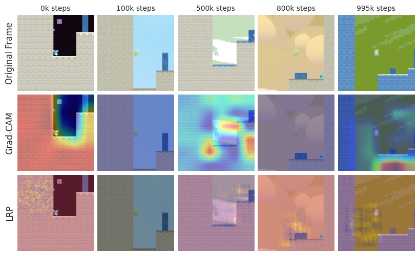

# Interpreting Exploration: Attention and Representation Dynamics in Unsupervised RL

[](https://arxiv.org/abs/2505.06279)
[](https://opensource.org/licenses/MIT)

A comprehensive interpretability framework for understanding how curiosity-driven agents explore and represent the world in unsupervised reinforcement learning settings. This repository contains the code and analysis for our research on attention mechanisms and representation learning in curiosity-driven exploration.

## Key Findings

Our analysis reveals several key insights about how different exploration strategies affect agent behavior:

1. **Attention Evolution**: Different exploration strategies lead to distinct attention patterns over time
2. **Reward Dynamics**: The interplay between intrinsic and extrinsic rewards shapes learning
3. **Representation Learning**: How agents encode and organize their understanding of the environment

### Attention Evolution Across Agents


*Evolution of attention patterns in PPO agent over training*

### Reward Trends


*Comparison of reward trends across different exploration strategies*

### Representation Learning


*UMAP visualization of learned representations in Transformer-RND agent*

##  Interpretability Visualizations

### Attention Maps (GradCAM)


### Combined Rewards Analysis


*Analysis of combined intrinsic and extrinsic rewards in RND agent*

### Attention Landscapes


*Attention landscape visualization for Transformer-RND agent*

##  Features

- **Multi-Agent Support**: DQN, RND, ICM, PPO, and Transformer-RND implementations
- **Attention Analysis**: Grad-CAM and LRP visualizations
- **Representation Analysis**: t-SNE/UMAP embeddings and clustering metrics
- **Behavioral Metrics**: Attention diversity, change rate, trajectory entropy
- **Comprehensive Logging**: CSV + TensorBoard integration

##  Project Structure

```
.
├── agents/              # Agent implementations
├── training/           # Training logic
├── analysis/           # Analysis tools
├── configs/            # Configuration files
├── utils/              # Utility functions
├── final_models/       # Trained model checkpoints
├── visualizations/     # Generated visualizations
│   ├── attention/     # Attention evolution plots
│   ├── rewards/       # Reward trend plots
│   ├── embeddings/    # UMAP/t-SNE visualizations
│   └── attention_landscapes/ # Attention landscape plots
└── run_all.py         # Training launcher
```

##  Installation

```bash
# Clone the repository
git clone https://github.com/Shashwatpandey4/unsupervised_rl_interp.git
cd unsupervised_rl_interp

# Create and activate virtual environment
python -m venv venv
source venv/bin/activate  # On Windows: venv\Scripts\activate

# Install dependencies
pip install -r requirements.txt
```

##  Usage

### Training Agents

```bash
python run_all.py --agent <agent_name>
```

Supported agents:
- `dqn` (extrinsic-only baseline)
- `rnd` (Random Network Distillation)
- `icm` (Intrinsic Curiosity Module)
- `ppo` (on-policy exploration)
- `transformer` (Transformer-RND)

### Analysis

The repository includes tools for:
- Attention visualization
- Reward analysis
- Representation learning analysis
- Behavioral metrics computation

##  Citation

If you use this code in your research, please cite our paper:

```bibtex
@article{Interpreting Exploration: Attention and Representation Dynamics in Unsupervised RL_2025,
  title={Interpreting Exploration: Attention and Representation Dynamics in Unsupervised RL},
  author={Shashwat Pandey},
  journal={arXiv preprint arXiv:2505.06279},
  year={2025}
}
```

##  License

This project is licensed under the MIT License - see the [LICENSE](LICENSE) file for details.

##  Acknowledgments

- Procgen environment
- PyTorch
- All other open-source libraries used in this project 